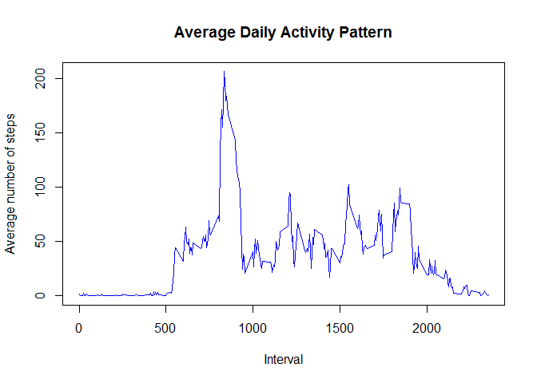
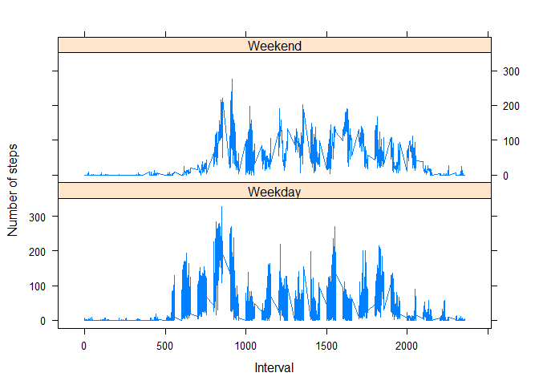

# Reproducible Research: Peer Assessment 1

## Loading and preprocessing the data

1 - Load the data (i.e. read.csv())

2 - Process/transform the data (if necessary) into a format suitable for your analysis


```r
setwd("E:\\Users\\Andrea\\Downloads\\Data\\Reproducible Research\\RepData_PeerAssessment1")
unzip(zipfile="activity.zip")
activity <- read.csv("activity.csv", colClasses = c("numeric", "character", 
                                              "numeric"))
# cast $date as date
activity$date <- as.Date(activity$date, "%Y-%m-%d")

# prepare dataset for question 4 and 5 

activity$day<-weekdays(activity$date)

for (i in 1:nrow(activity)) {
    if ((activity$day[i] == "sabato") | (activity$day[i] == "domenica")){
        activity$daytype[i] <- "Weekend"
    } else {
        activity$daytype[i] <- "Weekday"
    }
}
```


## What is mean total number of steps taken per day?

1 - Calculate the total number of steps taken per day


```r
totalXday <- aggregate(activity$steps, by=list(activity$date), FUN=sum, na.rm=TRUE)

names(totalXday) <- c("Date", "Total")
totalXday$Total<-as.numeric(totalXday$Total)

summary(totalXday)
```

```
##       Date                Total      
##  Min.   :2012-10-01   Min.   :    0  
##  1st Qu.:2012-10-16   1st Qu.: 6778  
##  Median :2012-10-31   Median :10395  
##  Mean   :2012-10-31   Mean   : 9354  
##  3rd Qu.:2012-11-15   3rd Qu.:12811  
##  Max.   :2012-11-30   Max.   :21194
```


2 - If you do not understand the difference between a histogram and a barplot, research the difference between them. Make a histogram of the total number of steps taken each day

```r
hist(totalXday$Total, 
     breaks=10, 
     xlab="Total number of steps", 
     col = "green", 
     main = "Histogram of Total Steps per Day")
```

 


3 - Calculate and report the mean and median of the total number of steps taken per day


```r
mean1   <- mean(totalXday$Total, na.rm=TRUE)
median1 <- median(totalXday$Total, na.rm=TRUE)
```


Mean is 9354.23 and the Median is 10395.00.

## What is the average daily activity pattern?

1 - Make a time series plot (i.e. type = "l") of the 5-minute interval (x-axis) and the average number of steps taken, averaged across all days (y-axis)


```r
mean <- aggregate(activity$steps, 
                       by=list(activity$interval), 
                       FUN=mean, 
                       na.rm=TRUE)

time_series <- tapply(activity$steps, activity$interval, mean, na.rm = TRUE)


plot(row.names(time_series), time_series, type = "l", xlab = "Interval", 
     ylab = "Average number of steps", main = "Average Daily Activity Pattern", 
     col = "blue")
```

 

2  - Which 5-minute interval, on average across all the days in the dataset, contains the maximum number of steps?


```r
max_interval <- which.max(time_series)
max_int <- names(max_interval)
```


## Imputing missing values

1 - Calculate and report the total number of missing values in the dataset (i.e. the total number of rows with NAs)


```r
NA_before <- sum(is.na(activity$steps))
```

Number of missing values: 2304


2 - Devise a strategy for filling in all of the missing values in the dataset. The strategy does not need to be sophisticated. For example, you could use `the mean/median for that day`, or the mean for that 5-minute interval, etc.

3 - Create a new dataset that is equal to the original dataset but with the missing data filled in.


```r
daily_mean <- aggregate(activity$steps , list(activity$day), mean , na.rm=TRUE)

names(daily_mean) <- c("Day", "Mean")
```

Daily mean : 
`R daily_mean`


```r
#if the value is NA, set the mean for the same day

#New dataset
n_activity <- activity

for (i in 1:nrow(n_activity)) {
    if (is.na(n_activity$steps[i])){
        n_activity$steps[i]<- daily_mean$Mean[daily_mean$Day==n_activity$day[i]]
    }
    
}

checkNA <- sum(is.na(n_activity$steps))

n_totalXday <- aggregate(n_activity$steps, by=list(n_activity$date), FUN=sum, na.rm=TRUE)

names(n_totalXday) <- c("Date", "Total")
n_totalXday$Total<-as.numeric(n_totalXday$Total)

summary(n_totalXday)
```

```
##       Date                Total      
##  Min.   :2012-10-01   Min.   :   41  
##  1st Qu.:2012-10-16   1st Qu.: 8918  
##  Median :2012-10-31   Median :11015  
##  Mean   :2012-10-31   Mean   :10821  
##  3rd Qu.:2012-11-15   3rd Qu.:12811  
##  Max.   :2012-11-30   Max.   :21194
```

4 - Make a histogram of the total number of steps taken each day and Calculate and report the mean and median total number of steps taken per day. Do these values differ from the estimates from the first part of the assignment? What is the impact of imputing missing data on the estimates of the total daily number of steps?


```r
hist(totalXday$Total, 
     breaks=10,      
     col=rgb(0.1,0.1,0.1,0.5),
     )

hist(n_totalXday$Total, 
     breaks=10,      
     col=rgb(0.8,0.8,0.8,0.5),
     add=T
     )
```

 

```r
mean2   <- mean(n_totalXday$Total, na.rm=TRUE)
median2 <- median(n_totalXday$Total, na.rm=TRUE)
```

For the first dataset Mean is 9354.23 and Median is 10395.00.
Adjusting NA values in new dataset give Mean 10821.21 and  Median is 11015.00.


```r
NA_after <- sum(is.na(n_activity$steps))
```

There were 2304 NA values befor adjustment , now there are 0 NA values.


## Are there differences in activity patterns between weekdays and weekends?

1 - Create a new factor variable in the dataset with two levels - "weekday" and "weekend" indicating whether a given date is a weekday or weekend day.

2 - Make a panel plot containing a time series plot (i.e. type = "l") of the 5-minute interval (x-axis) and the average number of steps taken, averaged across all weekday days or weekend days (y-axis). See the README file in the GitHub repository to see an example of what this plot should look like using simulated data.


```r
library(lattice)
```

```
## Warning: package 'lattice' was built under R version 3.1.3
```

```r
mean_by_day <- aggregate(activity$steps, 
                       by=list(activity$daytype, 
                               activity$day, activity$interval), mean, na.rm = TRUE)

names(mean_by_day) <- c("daytype", "weekday", "interval", "mean")

head(mean_by_day)
```

```
##   daytype   weekday interval     mean
## 1 Weekend  domenica        0 0.000000
## 2 Weekday   giovedì        0 5.875000
## 3 Weekday    lunedì        0 1.428571
## 4 Weekday   martedì        0 0.000000
## 5 Weekday mercoledì        0 4.250000
## 6 Weekend    sabato        0 0.000000
```

```r
xyplot(mean ~ interval | daytype, mean_by_day, 
       type="l", 
       lwd=1, 
       xlab="Interval", 
       ylab="Number of steps", 
       layout=c(1,2))
```

 

